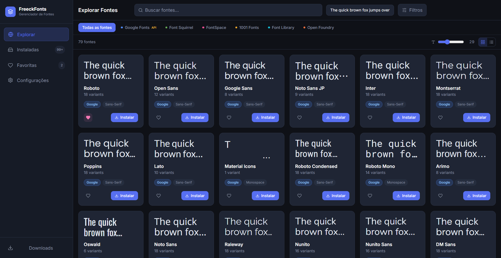

<div align="center">
  
</div>

<br />

<div align="center">

# FreeckFonts

**The hub for font discovery, preview, and installation.**  
Explore thousands of fonts from multiple online sources, preview them in real time, and install with one click — all inside a native desktop app.

<br />

[](https://github.com/freeckfonts/freeckfonts/releases)
[](LICENSE)
[](#installation)
[](https://electronjs.org)
[](https://typescriptlang.org)

</div>

---

## Table of Contents

- [About](#about)
- [Features](#features)
- [Supported Font Sources](#supported-font-sources)
- [Tech Stack](#tech-stack)
- [Architecture](#architecture)
- [Requirements](#requirements)
- [Installation](#installation)
- [Development](#development)
- [Build & Packaging](#build--packaging)
- [Configuration](#configuration)
- [Project Structure](#project-structure)
- [Contributing](#contributing)
- [License](#license)

---

## About

**FreeckFonts** is a cross-platform desktop application built with **Electron + React + TypeScript** that aggregates fonts from multiple online sources into a unified interface. No more switching between websites: discover, filter, preview, and install fonts directly from the app.

The project was born from the need for a faster typography workflow for designers and developers — no browser, no manual ZIP extraction, no wasted time.

---

## Features

### Discovery

- 🔍 **Real-time search** with debounce by font family name
- 🗂 **Advanced filters** by category (serif, sans-serif, monospace, display, handwriting), license, and source
- 📄 **Pagination** with on-demand loading
- 🖼 **Image preview** per font (where available), with fallback to live text rendered using the actual font

### Text Preview

- **Customizable preview text** — edit directly in the header
- **Adjustable preview size** — from 16 px to 64 px
- **Dynamic font loading** via `FontFace API` in the renderer
- **Graceful fallback** — if the image preview fails, text is rendered with the real font

### Download & Installation

- ⬇️ **Download with real-time progress** (per-variant progress bar)
- 🗜 **Automatic ZIP extraction** selecting only TTF/OTF files
- 🖥 **Native installation** to the OS fonts directory (Windows/macOS/Linux)
- 📋 **Floating downloads panel** with status, progress, and cancel option
- ✅ **Automatic format detection** (ZIP, TTF, OTF, WOFF) with clear error messages

### Management

- ❤️ **Favorites** — mark and quickly access your preferred fonts
- 📦 **Installed fonts** — view and manage all fonts installed through the app
- 💾 **Persistent cache** — data saved locally for offline use and fast startup

### Interface

- 🌙 **Dark theme** (default), light, and automatic (follows the system)
- 📐 **Grid or list view** — switch between cards and rows
- ⚙️ **Full settings page** with Google Fonts API Key, preview size, theme, and language

---

## Supported Font Sources

| Source            | URL                                              | Access type             | Available licenses   |
| ----------------- | ------------------------------------------------ | ----------------------- | -------------------- |
| **Google Fonts**  | [fonts.google.com](https://fonts.google.com)     | Official API (key req.) | OFL, Apache 2.0      |
| **Font Squirrel** | [fontsquirrel.com](https://www.fontsquirrel.com) | Public JSON API         | Free commercial      |
| **FontSpace**     | [fontspace.com](https://www.fontspace.com)       | Scraping                | Free commercial, OFL |
| **1001 Fonts**    | [1001fonts.com](https://www.1001fonts.com)       | Scraping                | Free commercial      |
| **Font Library**  | [fontlibrary.org](https://fontlibrary.org)       | Scraping                | OFL                  |
| **Open Foundry**  | [open-foundry.com](https://open-foundry.com)     | Scraping                | OFL                  |

> **Note:** Only Google Fonts requires an API Key. All other sources work without any account or setup.

---

## Tech Stack

| Layer           | Technology                                     | Version |
| --------------- | ---------------------------------------------- | ------- |
| Desktop runtime | [Electron](https://electronjs.org)             | 28      |
| UI framework    | [React](https://react.dev)                     | 18      |
| Language        | [TypeScript](https://typescriptlang.org)       | 5.3     |
| Build tool      | [electron-vite](https://electron-vite.org)     | 2       |
| Packaging       | [electron-builder](https://electron.build)     | 24      |
| Styling         | [Tailwind CSS](https://tailwindcss.com)        | 3.4     |
| Global state    | [Zustand](https://zustand-demo.pmnd.rs)        | 4.5     |
| HTTP            | [Axios](https://axios-http.com)                | 1.6     |
| HTML parsing    | [Cheerio](https://cheerio.js.org)              | 1       |
| ZIP extraction  | [AdmZip](https://github.com/cthackers/adm-zip) | 0.5     |
| Icons           | [Lucide React](https://lucide.dev)             | 0.363   |

---

## Architecture

The project follows the standard Electron architecture with a clear separation between the three processes:

```
┌─────────────────────────────────────────────────────┐
│                  RENDERER PROCESS                   │
│  React + Zustand + Tailwind                         │
│  ┌──────────┐ ┌──────────┐ ┌──────────┐ ┌────────┐ │
│  │  Browse  │ │Installed │ │Favorites │ │Settings│ │
│  └──────────┘ └──────────┘ └──────────┘ └────────┘ │
│  ┌────────────────────────────────────────────────┐ │
│  │ Stores: useAppStore | useFontStore | useDownloadStore │
│  └────────────────────────────────────────────────┘ │
└───────────────────────┬─────────────────────────────┘
                        │  IPC (bridge / contextBridge)
┌───────────────────────▼─────────────────────────────┐
│                   MAIN PROCESS                      │
│  ┌──────────────┐   ┌──────────────────────────────┐│
│  │ IPC Handlers │   │         Services             ││
│  │ - fonts      │──▶│ - AppDataService             ││
│  │ - downloads  │   │ - DownloadService            ││
│  │ - settings   │   │ - FontManagerService         ││
│  │ - system     │   │ - SourceRegistry             ││
│  └──────────────┘   │   ├─ GoogleFontsService      ││
│                     │   ├─ FontSquirrelService     ││
│                     │   ├─ FontSpaceService        ││
│                     │   ├─ Fonts1001Service        ││
│                     │   ├─ FontLibraryService      ││
│                     │   └─ OpenFoundryService      ││
│                     └──────────────────────────────┘│
└─────────────────────────────────────────────────────┘
```

**Design principles:**

- **SOP (Single Object of Purpose):** each service has a single responsibility
- **BaseSourceService:** abstract base class for all font services; centralises HTTP client, logging, pagination, and filters
- **SourceRegistry:** central registry that routes calls to the correct service by `FontSource`
- **Bridge/contextBridge:** all Renderer → Main communication goes through the preload layer; Node.js APIs are never exposed to the renderer

---

## Requirements

- **Node.js** 20 or higher
- **npm** 10 or higher
- OS: Windows 10+, macOS 11+, or Linux (Ubuntu 20.04+)

Install Node.js at [nodejs.org](https://nodejs.org)

---

## Installation

Download the installer for your OS from the [Releases page](https://github.com/freeckfonts/freeckfonts/releases/latest):

| OS                    | File                             | Description                      |
| --------------------- | -------------------------------- | -------------------------------- |
| Windows               | `FreeckFonts-Setup-x.x.x.exe`    | NSIS installer (recommended)     |
| Windows               | `FreeckFonts-x.x.x-portable.exe` | Portable executable (no install) |
| macOS (Intel)         | `FreeckFonts-x.x.x-x64.dmg`      | Disk image for Intel Macs        |
| macOS (Apple Silicon) | `FreeckFonts-x.x.x-arm64.dmg`    | Disk image for M1/M2/M3          |
| Linux                 | `FreeckFonts-x.x.x.AppImage`     | Universal AppImage               |
| Linux                 | `FreeckFonts-x.x.x.deb`          | Debian/Ubuntu package            |

---

## Development

```bash
# 1. Clone the repository
git clone https://github.com/freeckfonts/freeckfonts.git
cd freeckfonts

# 2. Install dependencies
npm install

# 3. Start in development mode (hot reload enabled)
npm run dev
```

The app opens automatically with DevTools available for the renderer process.

---

## Build & Packaging

```bash
# Compile only (no packaging)
npm run build

# Package for the current platform
npm run package

# Package for a specific platform
npm run package:win    # Windows (.exe NSIS + portable)
npm run package:mac    # macOS (.dmg + .zip for x64 and arm64)
npm run package:linux  # Linux (.AppImage + .deb)
```

Artifacts are generated in `dist-electron/`.

### Automatic CI/CD

The project includes a GitHub Actions pipeline at `.github/workflows/release.yml` that automatically builds binaries for all 3 platforms and publishes a GitHub Release when a semantic tag is pushed:

```bash
git tag v1.0.0
git push origin v1.0.0
```

---

## Configuration

### Google Fonts API Key

Google Fonts requires a free API key to list fonts:

1. Go to [console.cloud.google.com](https://console.cloud.google.com)
2. Create or select a project
3. Enable the **Web Fonts Developer API**
4. Generate an API key under **Credentials**
5. In FreeckFonts, go to **Settings → Google Fonts API Key** and paste the key

> Without the API Key, the Google Fonts tab will be empty. All other sources work without any setup.

### Fonts directory

Fonts are automatically installed to the default system directory:

| OS      | Directory              |
| ------- | ---------------------- |
| Windows | `C:\Windows\Fonts`     |
| macOS   | `~/Library/Fonts`      |
| Linux   | `~/.local/share/fonts` |

The path is shown in **Settings → Fonts Folder**.

---

## Project Structure

```
freeckfonts/
├── .github/
│   ├── images/               # README images
│   └── workflows/
│       └── release.yml       # CI/CD pipeline
├── src/
│   ├── main/                 # Main process (Node.js/Electron)
│   │   ├── index.ts          # Main process entry point
│   │   ├── ipc/              # IPC handlers (fonts, downloads, settings, system, update)
│   │   ├── services/
│   │   │   ├── AppDataService.ts      # Local persistence (JSON)
│   │   │   ├── DownloadService.ts     # Download/extraction/installation pipeline
│   │   │   ├── FontManagerService.ts  # Native font installation to OS
│   │   │   ├── UpdateService.ts       # Auto-update via electron-updater
│   │   │   └── sources/               # Per-source font services
│   │   │       ├── BaseSourceService.ts
│   │   │       ├── GoogleFontsService.ts
│   │   │       ├── FontSquirrelService.ts
│   │   │       ├── FontSpaceService.ts
│   │   │       ├── Fonts1001Service.ts
│   │   │       ├── FontLibraryService.ts
│   │   │       ├── OpenFoundryService.ts
│   │   │       └── SourceRegistry.ts
│   │   └── utils/
│   │       ├── logger.ts
│   │       └── platformUtils.ts
│   ├── preload/              # contextBridge (main ↔ renderer)
│   │   ├── index.ts
│   │   └── index.d.ts
│   ├── renderer/             # Renderer process (React)
│   │   └── src/
│   │       ├── App.tsx
│   │       ├── components/   # FontCard, FilterPanel, DownloadPanel, UpdateDialog, Layout
│   │       ├── hooks/        # useDebounce, useFontPreview, useUpdater
│   │       ├── pages/        # Browse, Installed, Favorites, Settings, Onboarding
│   │       ├── store/        # Zustand stores (app, font, download, update)
│   │       └── utils/        # bridge.ts
│   └── shared/
│       └── types.ts          # Types shared between main and renderer
├── electron.vite.config.ts
├── package.json
├── tailwind.config.js
├── tsconfig.json
├── LICENSE
└── README.md
```

---

## Contributing

Contributions are welcome! Read [CONTRIBUTING.md](CONTRIBUTING.md) to learn how to set up the environment, code standards, how to add new languages, how to report bugs, and how to open a Pull Request.

---

## License

FreeckFonts is distributed under the **MIT License + Commons Clause**.

The idea is simple: the software is free for any use — including professional and commercial — but no one may **sell** the software itself or bundle its code into a paid commercial product or service.

| Permission                                                     | Status        |
| -------------------------------------------------------------- | ------------- |
| ✅ Personal use                                                | Allowed       |
| ✅ Professional and commercial use as a tool                   | Allowed       |
| ✅ Designers, editors, writers using it daily in paid projects | Allowed       |
| ✅ Educational, governmental, and non-profit use               | Allowed       |
| ✅ Modifying the code for personal use                         | Allowed       |
| ✅ Free redistribution with this license                       | Allowed       |
| ❌ Selling FreeckFonts as a product                            | **Forbidden** |
| ❌ Offering it as a paid service (SaaS)                        | **Forbidden** |
| ❌ Embedding the code in a commercial product or service       | **Forbidden** |
| ❌ Redistributing the software for a fee                       | **Forbidden** |

Read the full license text in [LICENSE](LICENSE).

For commercial licensing of the source code, contact the project maintainers.

---

<div align="center">
  <sub>Made with ❤️ for the design and typography community</sub>
</div>
